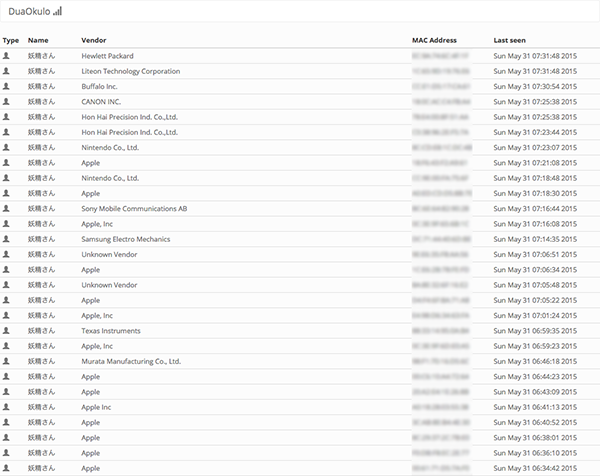
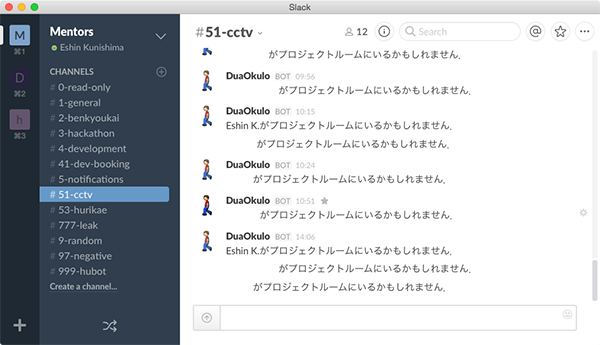

# DuaOkulo
IEEE802.11 Based Room Access Logger

```
.
├── README.md : it's me
├── epoch.py : unix time converter
├── init
│   └── okulo.service : systemd service file
├── okulo.py : main script
├── oui.db : pre-generated OUI database
├── oui.py : OUI parser
├── slack.py : slack notify helper
├── static : self hosting Bootstrap files for no internet connection
└── templates
    └── index.html : simple admin page
```

## Requirements
 - airodump-ng (Aircrack-ng suites include it, but DuaOkulo needs modified version. Sorry, I lost its code...)
 - Flask
 - Python 3

## Demo



